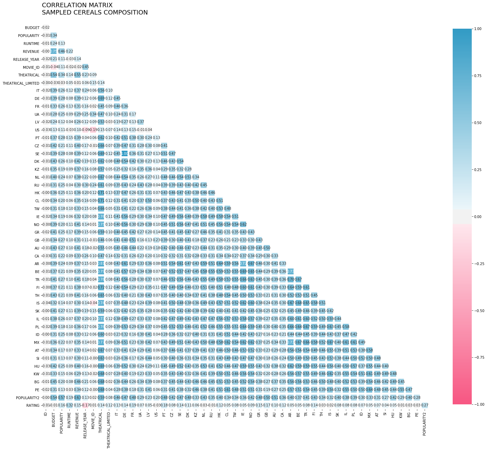
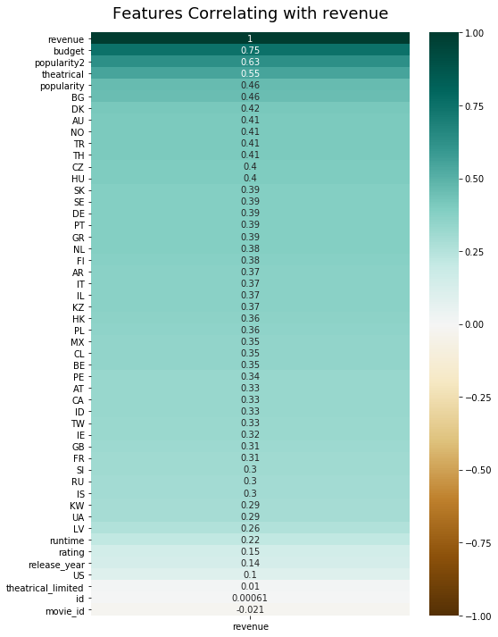
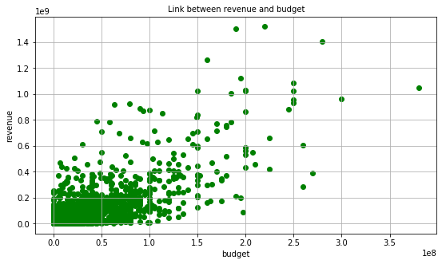
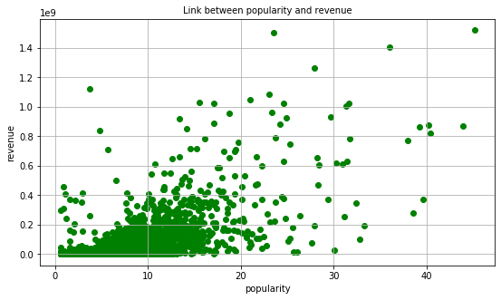
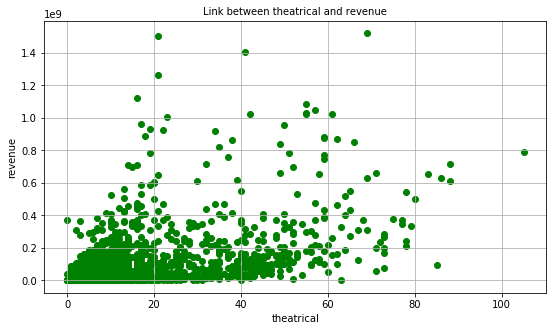
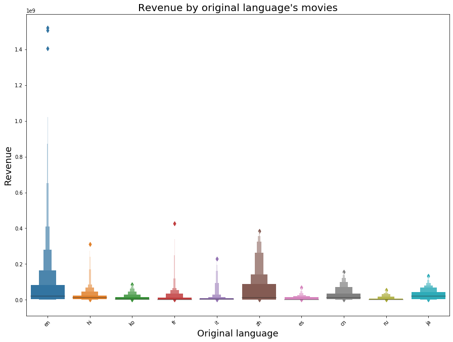
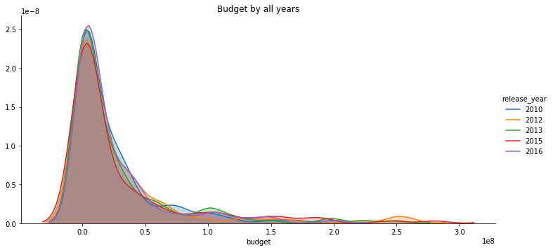
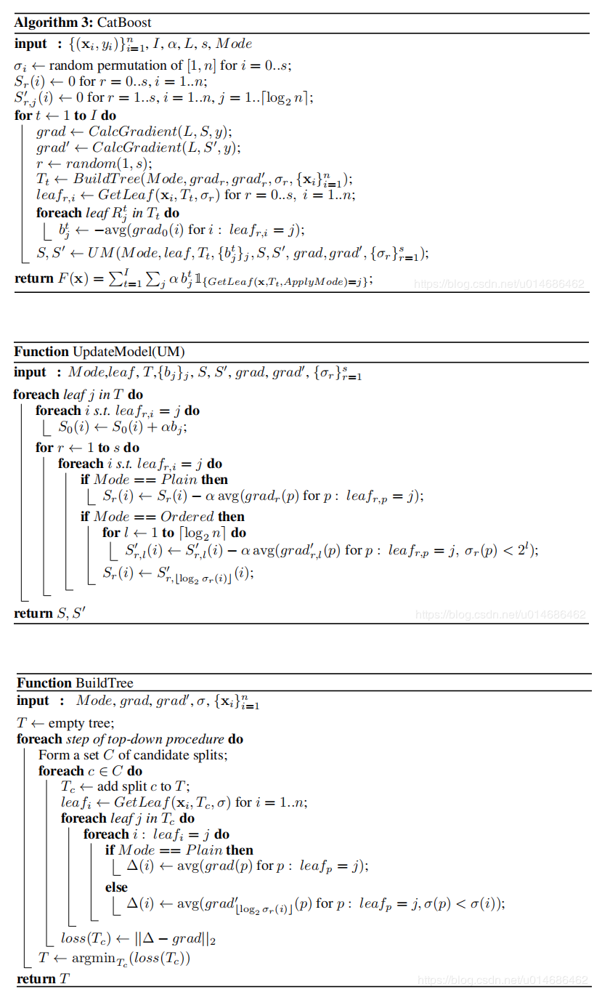
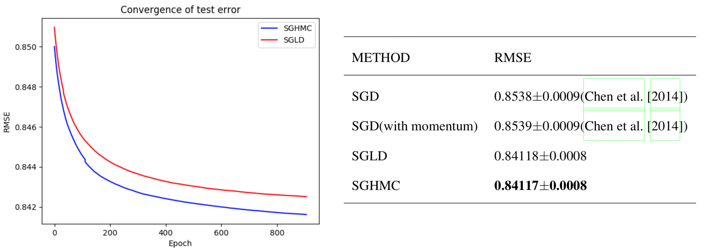

## CS 487/519 Applied Machine Learning - Movie Recommendation


## Project Description

- EDA and Predicting the avenue of a movie based on features which have the highest relation to avenue, such as budgets, popularity2, theatrical, etc.
- Recommendation system engines
	- Demographic Filtering
	- Content Based Filtering
	- Collaborative Filtering (SVD)
	- Deep Learning Approaches
		- DeepFM
	    - Wide & Deep
		- DIN
		- DNN
  
## Datasets

- Prediction of Revenue uses <a href= 'https://www.themoviedb.org/'> The Movie Database(TMDB)</a> that contains 7398 records.
- Recommendation Systems uses <a href= 'https://www.themoviedb.org/'> The Movie Database(TMDB)</a> and 
<a href= 'https://grouplens.org/datasets/movielens/1m/'> MovieLens 1M Dataset</a> that contains features of id, budget, content overview, keywords, and user-movie rating matrix.

## Experiments

### Prediction of movie revenue for TMDB 5000 Movie Dataset
### 1. EDA

- Calculated correlation between all fetures 



- Features Correlating with revenue



- Budget, popularity, theatrical have the highest relation to revenue:





- Relation between revenue and Languages



- Relation betwwen budget and recent release year




### 2. Prediction of movie revenue
- Prediction with catboost, XGBoost, LightGBM
- The final result is exponentially weighted average among three approaches

(weight = exp(w_1 * cat + w_2 * xgb + w_3 * lgbm))
, where w_1 + w_2 + w_3 = 1.0


#### 2.1 XGBoost

#### 2.2 lightGBM
* Based on XGBoost, lightGBM uses histogram algorithm

#### 2.3 CatBoost
* CatBoost uses Gradient Boost and Categorical Features

Pseudocode:



## Recommendation systems

### 1. Naive recommendation systems 
#### 1.1 Demographic Filtering (code: <a href= 'https://github.com/anjujames33/proj/tree/main/stage3/naive_recommender'> Naive recommender</a>)
They offer generalized recommendations to every user, based on movie popularity and/or genre. 
The System recommends the same movies to users with similar demographic features. 
Since each user is different , this approach is considered to be too simple. 
The basic idea behind this system is that movies that are more popular and critically acclaimed will have a higher probability of being liked by the average audience.
`score = \frac{v}{v+m}*r + \frac{m}{m+v}*c`.
`v` - votes, `m` - avg votes，`r` - rating, `c` - avg rating

```
title       							score
The Shawshank Redemption          				8.059258
Fight Club          						7.939256
The Dark Knight         					7.920020
Pulp Fiction          						7.904645
Inception         						7.863239
The Godfather          						7.851236
Interstellar         						7.809479
Forrest Gump         						7.803188
The Lord of the Rings: The Return of the King   		7.727243
The Empire Strikes Back          				7.697884
```

#### 1.2 Content Based Filtering
They suggest similar items based on a particular item. This system uses item metadata, 
such as genre, director, description, actors, etc. for movies, to make these recommendations. 
The general idea behind these recommender systems is that if a person liked a particular item, 
he or she will also like an item that is similar to it.

#### （1）Keyword-based
* Convert keyword to word vectors by using `TfidfVectorizer` im sklearn. Then calculate similarity by `cosine`.

 ```
 - Input： The Dark Knight Rises
 - Output： The Dark Knight
			Batman Forever
			Batman Returns
			Batman
			Batman: The Dark Knight Returns, Part 2
			Batman Begins
			Slow Burn
			Batman v Superman: Dawn of Justice
			JFK
			Batman & Robin
 ```

#### （2）Content-based
*  Convert content to word vectors by using `CountVectorizer` im sklearn. Then calculate similarity by `cosine`.
 
 ```
 - Input： The Dark Knight Rises
 - Output： The Dark Knight
			Batman Begins
			Amidst the Devil's Wings
			The Prestige
			Romeo Is Bleeding
			Black November
			Takers
			Faster
			Catwoman
			Gangster Squad
 
 ```

#### 1.3. Collaborative Filtering (code: <a href= 'https://github.com/anjujames33/proj/tree/main/stage3/personal_recommender'> Personal recommender</a>)
This system matches persons with similar interests and provides recommendations based on this matching. 
Collaborative filters do not require item metadata like its content-based counterparts.
* Uses 'MovieLens 1M' dataset

#### （1）Movie similarity

```
- Input： Avengers: Infinity War - Part I (2018)
- Output： Thor: Ragnarok (2017)
		Captain America: Civil War (2016)
		Deadpool 2 (2018)
		Doctor Strange (2016)
		Guardians of the Galaxy 2 (2017)
		Iron Man (2008)
		Untitled Spider-Man Reboot (2017)
		Avengers, The (2012)
		Inception (2010)
		Logan (2017)
```

#### （2）User similarity
* movie ratings for a certain user as an eigenvector
	* pick up top 10 most similar users 
	* top 10 highest rating movies 

```
- Input：userID=2
- Output： Forrest Gump (1994)
		Pulp Fiction (1994)
		Silence of the Lambs, The (1991)
		Matrix, The (1999)
		Donnie Darko (2001)
		
- Input：userID=6
- Output： Beverly Hills Cop III (1994)
		Demolition Man (1993)
		Quiz Show (1994)
		Drop Zone (1994)
		Home Alone (1990)
```

* **Results**
	* train_test_split(test_size=0.15)
	* Recommend top 10 movies to each user, 6040 in total


#### (3) SVD
Gradient descent algorithms:
* (SGD)
* (SGLD)
* (SGHMC)



### 2. Ensemble recommendation systems (On-Going)

#### 2.1 KNN+content
* 10 similar users + content + recommending top 10 similar movies

#### 2.2 userKNN+movieKNN
* 10 similar users + keyword + recommending top 10 similar movies

#### 2.3 userKNN+SVD
* 10 similar users + predicting + recommending top 10 highest rating movies

### 3. Advanced approaches (On-Going)
* Word2vec (Item2vec)
* Wide&Deep
* Nerual CF
* DeepFM
* DIN(Deep Interest Network)

See reference papers: <a href= 'https://github.com/anjujames33/proj/tree/main/stage3/personal_recommender'> Deep Learning Approaches</a>


